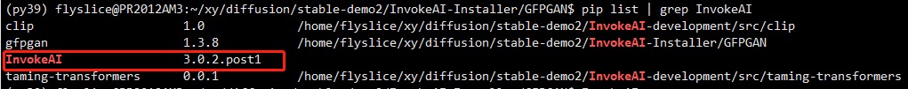
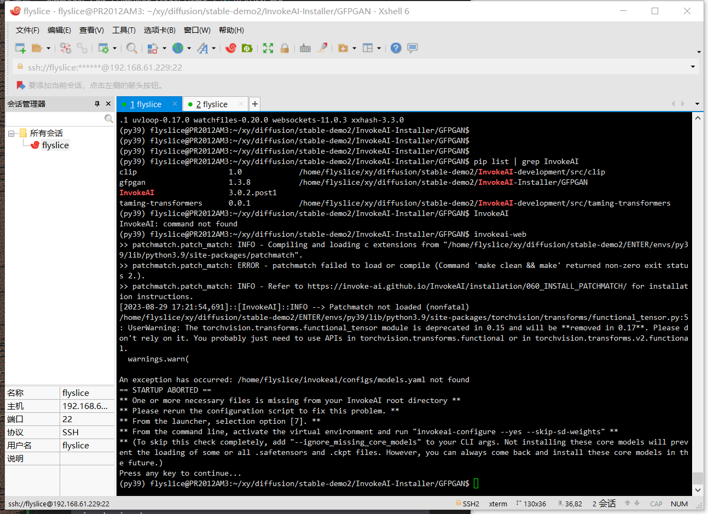
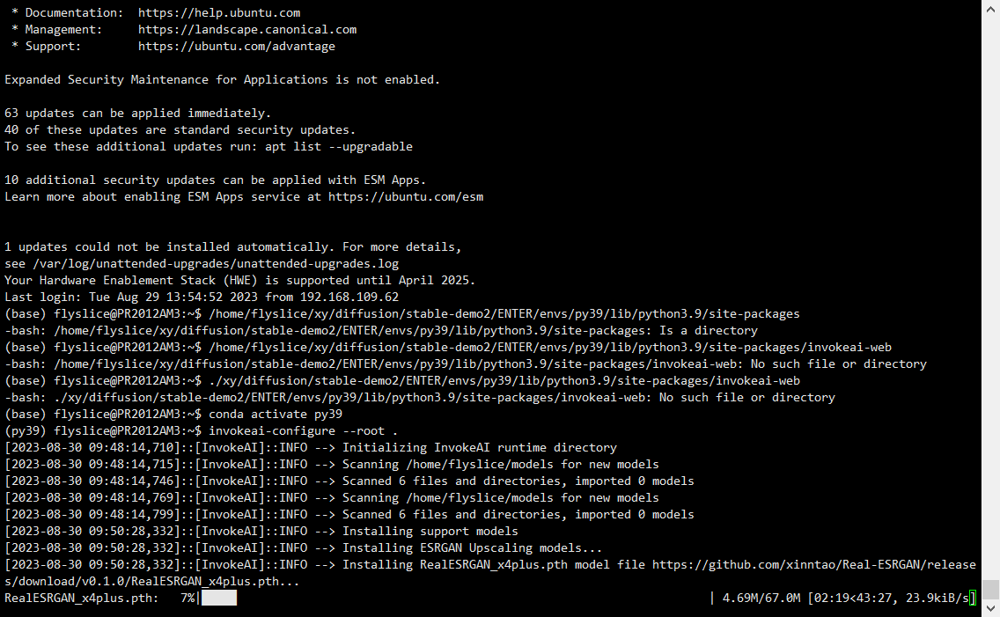
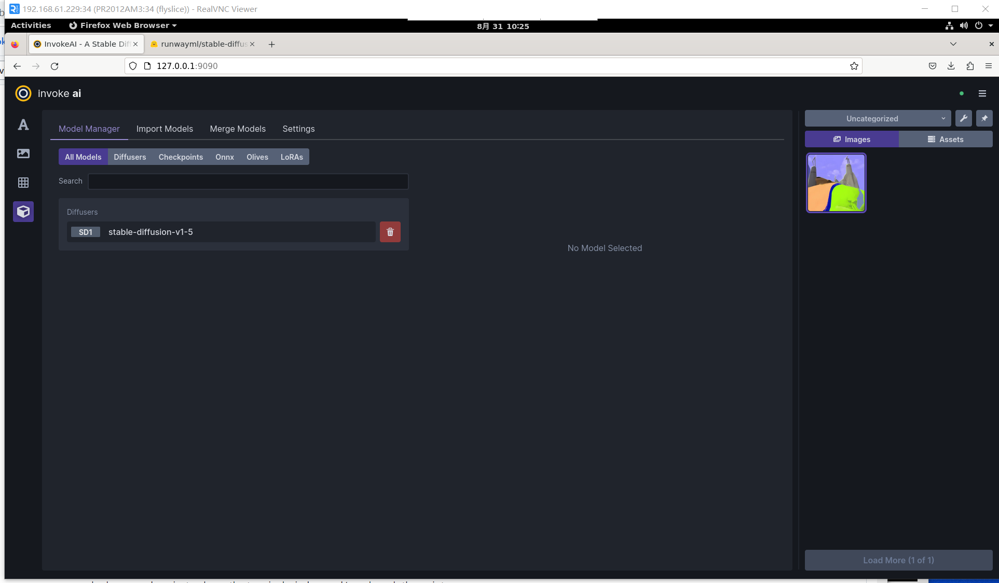
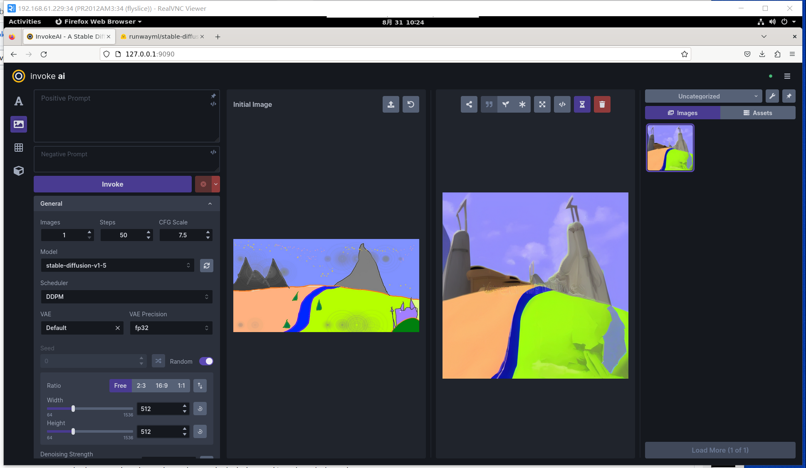

# 实验log - 记安装运行stable diffusion models

# 更新时间
2023.8.29

## 问题:
1. 安装stable-diffusion遇到安装包错误；
```shell
ModuleNotFoundError: No module named 'torch'
```

而实际torch已安装(不确定安装在哪个位置) - 通过pip list | grep torch 获得结果
```shell
pytorch-lightning        1.9.0
torch                    2.0.0+cu118
torchaudio               2.0.0
torchmetrics             1.1.0
torchvision              0.15.1+cu118
```

完整报错内容:
```shell
Getting requirements to build wheel ... error
  error: subprocess-exited-with-error
  
  × Getting requirements to build wheel did not run successfully.
  │ exit code: 1
  ╰─> [17 lines of output]
      Traceback (most recent call last):
        File "/home/flyslice/invokeai/.venv/lib/python3.9/site-packages/pip/_vendor/pyproject_hooks/_in_process/_in_process.py", line 353, in <module>
          main()
        File "/home/flyslice/invokeai/.venv/lib/python3.9/site-packages/pip/_vendor/pyproject_hooks/_in_process/_in_process.py", line 335, in main
          json_out['return_val'] = hook(**hook_input['kwargs'])
        File "/home/flyslice/invokeai/.venv/lib/python3.9/site-packages/pip/_vendor/pyproject_hooks/_in_process/_in_process.py", line 118, in get_requires_for_build_wheel
          return hook(config_settings)
        File "/tmp/pip-build-env-4qyukfuv/overlay/lib/python3.9/site-packages/setuptools/build_meta.py", line 355, in get_requires_for_build_wheel
          return self._get_build_requires(config_settings, requirements=['wheel'])
        File "/tmp/pip-build-env-4qyukfuv/overlay/lib/python3.9/site-packages/setuptools/build_meta.py", line 325, in _get_build_requires
          self.run_setup()
        File "/tmp/pip-build-env-4qyukfuv/overlay/lib/python3.9/site-packages/setuptools/build_meta.py", line 507, in run_setup
          super(_BuildMetaLegacyBackend, self).run_setup(setup_script=setup_script)
        File "/tmp/pip-build-env-4qyukfuv/overlay/lib/python3.9/site-packages/setuptools/build_meta.py", line 341, in run_setup
          exec(code, locals())
        File "<string>", line 8, in <module>
      ModuleNotFoundError: No module named 'torch'
      [end of output]
  
  note: This error originates from a subprocess, and is likely not a problem with pip.
error: subprocess-exited-with-error

× Getting requirements to build wheel did not run successfully.
│ exit code: 1
╰─> See above for output.

note: This error originates from a subprocess, and is likely not a problem with pip.
Traceback (most recent call last):
  File "/home/flyslice/xy/diffusion/stable-demo2/InvokeAI-Installer/./lib/main.py", line 51, in <module>
    inst.install(**args.__dict__)
  File "/home/flyslice/xy/diffusion/stable-demo2/InvokeAI-Installer/lib/installer.py", line 181, in install
    self.instance.install(
  File "/home/flyslice/xy/diffusion/stable-demo2/InvokeAI-Installer/lib/installer.py", line 237, in install
    self.install_app(extra_index_url, optional_modules, find_links)
  File "/home/flyslice/xy/diffusion/stable-demo2/InvokeAI-Installer/lib/installer.py", line 316, in install_app
    pip[
  File "/tmp/invokeai-installer-tmph0whiah0/lib/python3.9/site-packages/plumbum/commands/modifiers.py", line 145, in __rand__
    cmd(
  File "/tmp/invokeai-installer-tmph0whiah0/lib/python3.9/site-packages/plumbum/commands/base.py", line 113, in __call__
    return self.run(args, **kwargs)[1]
  File "/tmp/invokeai-installer-tmph0whiah0/lib/python3.9/site-packages/plumbum/commands/base.py", line 252, in run
    return p.run()
  File "/tmp/invokeai-installer-tmph0whiah0/lib/python3.9/site-packages/plumbum/commands/base.py", line 215, in runner
    return run_proc(p, retcode, timeout)
  File "/tmp/invokeai-installer-tmph0whiah0/lib/python3.9/site-packages/plumbum/commands/processes.py", line 299, in run_proc
    return _check_process(proc, retcode, timeout, stdout, stderr)
  File "/tmp/invokeai-installer-tmph0whiah0/lib/python3.9/site-packages/plumbum/commands/processes.py", line 17, in _check_process
    proc.verify(retcode, timeout, stdout, stderr)
  File "/tmp/invokeai-installer-tmph0whiah0/lib/python3.9/site-packages/plumbum/machines/base.py", line 27, in verify
    raise ProcessExecutionError(
plumbum.commands.processes.ProcessExecutionError: Unexpected exit code: 1
Command line: | /home/flyslice/invokeai/.venv/bin/pip install --require-virtualenv --use-pep517 '/home/flyslice/xy/diffusion/stable-demo2/InvokeAI-Installer/lib/InvokeAI-3.0.2.post1-py3-none-any.whl[xformers,onnx-cuda]' --extra-index-url https://download.pytorch.org/whl/cu118
```

在安装wheel时报错，显示`/home/flyslice/invokeai/.venv/bin/pip install --require-virtualenv --use-pep517 '/home/flyslice/xy/diffusion/stable-demo2/InvokeAI-Installer/lib/InvokeAI-3.0.2.post1-py3-none-any.whl[xformers,onnx-cuda]' --extra-index-url https://download.pytorch.org/whl/cu118`运行./install.sh中的此行shell命令时报错，重新单独运行这一行还是会报相同的错误，目前还未解决。

### 安装教程

invoke-ai GitHub官网

[https://github.com/invoke-ai/InvokeAI/tree/main/installer](https://github.com/invoke-ai/InvokeAI/tree/main/installer)

Project homepage: https://github.com/invoke-ai/InvokeAI


### 查看install.sh:
```sh
(py39) flyslice@PR2012AM3:~/xy/diffusion/stable-demo2/InvokeAI-Installer$ cat ./install.sh 
#!/bin/bash

# make sure we are not already in a venv
# (don't need to check status)
deactivate >/dev/null 2>&1
scriptdir=$(dirname "$0")
cd $scriptdir

function version { echo "$@" | awk -F. '{ printf("%d%03d%03d%03d\n", $1,$2,$3,$4); }'; }

MINIMUM_PYTHON_VERSION=3.9.0
MAXIMUM_PYTHON_VERSION=3.11.100
PYTHON=""
for candidate in python3.11 python3.10 python3.9 python3 python ; do
    if ppath=`which $candidate`; then
        # when using `pyenv`, the executable for an inactive Python version will exist but will not be operational
        # we check that this found executable can actually run
        if [ $($candidate --version &>/dev/null; echo ${PIPESTATUS}) -gt 0 ]; then continue; fi

        python_version=$($ppath -V | awk '{ print $2 }')
        if [ $(version $python_version) -ge $(version "$MINIMUM_PYTHON_VERSION") ]; then
            if [ $(version $python_version) -le $(version "$MAXIMUM_PYTHON_VERSION") ]; then
                PYTHON=$ppath
                break
            fi
        fi
    fi
done

if [ -z "$PYTHON" ]; then
    echo "A suitable Python interpreter could not be found"
    echo "Please install Python $MINIMUM_PYTHON_VERSION or higher (maximum $MAXIMUM_PYTHON_VERSION) before running this script. See instructions at $INSTRUCTIONS for help."
    echo "For the best user experience we suggest enlarging or maximizing this window now."
    read -p "Press any key to exit"
    exit -1
fi

exec $PYTHON ./lib/main.py ${@}
read -p "Press any key to exit"
```

### 类似问题但不符合:
github上：

no model named 'torch' #740 - [https://github.com/facebookresearch/xformers/issues/740](https://github.com/facebookresearch/xformers/issues/740)

× '''Getting requirements to build wheel did not run successfully. │ exit code: 1 ╰─> [21 lines of output]''' #4595 - [https://github.com/Significant-Gravitas/Auto-GPT/issues/4595](https://github.com/Significant-Gravitas/Auto-GPT/issues/4595)

Error in setup.py "No module named 'torch'" when installing with Poetry #156 - [https://github.com/rusty1s/pytorch_sparse/issues/156](https://github.com/rusty1s/pytorch_sparse/issues/156)

### 中途尝试通过pip install InvokeAI 直接安装 仍然失败
参考[https://invoke-ai.github.io/InvokeAI/installation/010_INSTALL_AUTOMATED/#stable-diffusion-xl-generation-fails-after-trying-to-load-unet](https://invoke-ai.github.io/InvokeAI/installation/010_INSTALL_AUTOMATED/#stable-diffusion-xl-generation-fails-after-trying-to-load-unet)

#### 报错
```shell
Preparing metadata (setup.py) ... error
  error: subprocess-exited-with-error
  
  × python setup.py egg_info did not run successfully.
  │ exit code: 1
  ╰─> [17 lines of output]
      Traceback (most recent call last):
        File "/tmp/pip-install-c2b4h0c7/realesrgan_fed472ef215948b384f45de0bf3525fb/setup.py", line 48, in get_hash
          from facexlib.version import __version__
      ModuleNotFoundError: No module named 'facexlib'
      
      During handling of the above exception, another exception occurred:
      
      Traceback (most recent call last):
        File "<string>", line 2, in <module>
        File "<pip-setuptools-caller>", line 34, in <module>
        File "/tmp/pip-install-c2b4h0c7/realesrgan_fed472ef215948b384f45de0bf3525fb/setup.py", line 89, in <module>
          write_version_py()
        File "/tmp/pip-install-c2b4h0c7/realesrgan_fed472ef215948b384f45de0bf3525fb/setup.py", line 65, in write_version_py
          sha = get_hash()
        File "/tmp/pip-install-c2b4h0c7/realesrgan_fed472ef215948b384f45de0bf3525fb/setup.py", line 51, in get_hash
          raise ImportError('Unable to get git version')
      ImportError: Unable to get git version
      [end of output]
  
  note: This error originates from a subprocess, and is likely not a problem with pip.
error: metadata-generation-failed

× Encountered error while generating package metadata.
╰─> See above for output.

note: This is an issue with the package mentioned above, not pip.
hint: See above for details.
```

在使用pip install facexlib后重新install InvokeAI获得新报错
```shell
  Preparing metadata (setup.py) ... done
ERROR: Cannot install realesrgan because these package versions have conflicting dependencies.

The conflict is caused by:
    basicsr 1.4.2 depends on tb-nightly
    basicsr 1.4.1 depends on tb-nightly
    basicsr 1.4.0 depends on tb-nightly
    basicsr 1.3.5 depends on tb-nightly
    basicsr 1.3.4.9 depends on tb-nightly
    basicsr 1.3.4.8 depends on tb-nightly
    basicsr 1.3.4.7 depends on tb-nightly
    basicsr 1.3.4.6 depends on tb-nightly
    basicsr 1.3.4.4 depends on tb-nightly
    basicsr 1.3.4.3 depends on tb-nightly
    basicsr 1.3.4.2 depends on tb-nightly
    basicsr 1.3.4.1 depends on tb-nightly
    basicsr 1.3.4.0 depends on tb-nightly
    basicsr 1.3.3.11 depends on tb-nightly
    basicsr 1.3.3.10 depends on tb-nightly
    basicsr 1.3.3.9 depends on tb-nightly
    basicsr 1.3.3.8 depends on tb-nightly
    basicsr 1.3.3.7 depends on tb-nightly
    basicsr 1.3.3.6 depends on tb-nightly
    basicsr 1.3.3.5 depends on tb-nightly
    basicsr 1.3.3.4 depends on tb-nightly
    basicsr 1.3.3.3 depends on tb-nightly
    basicsr 1.3.3.1 depends on tb-nightly
    basicsr 1.3.3 depends on tb-nightly
    basicsr 1.3.2 depends on tb-nightly
    basicsr 1.3.1 depends on tb-nightly

To fix this you could try to:
1. loosen the range of package versions you've specified
2. remove package versions to allow pip attempt to solve the dependency conflict

ERROR: ResolutionImpossible: for help visit https://pip.pypa.io/en/latest/topics/dependency-resolution/#dealing-with-dependency-conflicts

```

### 解决
Can't pip install realesrgan on M1 #316

[https://github.com/invoke-ai/InvokeAI/issues/316](https://github.com/invoke-ai/InvokeAI/issues/316)

```shell
git clone git@github.com:TencentARC/GFPGAN.git
cd GFPGAN
pip install basicsr facexlib
pip install -r requirements.txt
python setup.py develop
```

再次运行pip install InvokeAI, output如下:
```shell
(py39) flyslice@PR2012AM3:~/xy/diffusion/stable-demo2/InvokeAI-Installer/GFPGAN$ pip install InvokeAI
Looking in indexes: https://pypi.tuna.tsinghua.edu.cn/simple
Collecting InvokeAI
  Using cached https://pypi.tuna.tsinghua.edu.cn/packages/c1/ba/fedcb671606849cfb02e6ff5fb58d8d0ca9d65e5a1a9026216b6cda2e604/InvokeAI-3.0.2.post1-py3-none-any.whl (1.6 MB)
Collecting accelerate~=0.21.0 (from InvokeAI)
  Using cached https://pypi.tuna.tsinghua.edu.cn/packages/70/f9/c381bcdd0c3829d723aa14eec8e75c6c377b4ca61ec68b8093d9f35fc7a7/accelerate-0.21.0-py3-none-any.whl (244 kB)
Collecting albumentations (from InvokeAI)
  Using cached https://pypi.tuna.tsinghua.edu.cn/packages/9b/f6/c486cedb4f75147232f32ec4c97026714cfef7c7e247a1f0427bc5489f66/albumentations-1.3.1-py3-none-any.whl (125 kB)
Requirement already satisfied: click in /home/flyslice/xy/diffusion/stable-demo2/ENTER/envs/py39/lib/python3.9/site-packages (from InvokeAI) (8.0.4)
Collecting clip-anytorch (from InvokeAI)
  Using cached https://pypi.tuna.tsinghua.edu.cn/packages/10/70/b92c966262ee935e32ae6c5b124f886fa9a8c441830f1764be31682976a6/clip_anytorch-2.5.2-py3-none-any.whl (1.4 MB)
Collecting compel~=2.0.0 (from InvokeAI)
  Using cached https://pypi.tuna.tsinghua.edu.cn/packages/cd/5a/18c7d44406994c31a61af1560d0cdbd6e5c27b2fb7cb6146c2f19e40ec25/compel-2.0.2-py3-none-any.whl (30 kB)
Collecting controlnet-aux>=0.0.6 (from InvokeAI)
  Using cached https://pypi.tuna.tsinghua.edu.cn/packages/48/89/a9c1d8fea2e1266eed9ea505215efa330de3385bee618326252c62edbccd/controlnet_aux-0.0.6-py3-none-any.whl (261 kB)
Collecting timm==0.6.13 (from InvokeAI)
  Using cached https://pypi.tuna.tsinghua.edu.cn/packages/f6/c6/806d9b2fa95f418ad700dd206a935d5e8d7355505589dd13a70eb3a45048/timm-0.6.13-py3-none-any.whl (549 kB)
Collecting datasets (from InvokeAI)
  Using cached https://pypi.tuna.tsinghua.edu.cn/packages/66/f8/38298237d18d4b6a8ee5dfe390e97bed5adb8e01ec6f9680c0ddf3066728/datasets-2.14.4-py3-none-any.whl (519 kB)
Collecting diffusers[torch]~=0.19.0 (from InvokeAI)
  Using cached https://pypi.tuna.tsinghua.edu.cn/packages/f6/a8/20b5fddffa832386c51e5a536a08e0a4024ed5c14c9e0758d422cb562895/diffusers-0.19.3-py3-none-any.whl (1.3 MB)
Collecting dnspython~=2.4.0 (from InvokeAI)
  Using cached https://pypi.tuna.tsinghua.edu.cn/packages/f6/b4/0a9bee52c50f226a3cbfb54263d02bb421c7f2adc136520729c2c689c1e5/dnspython-2.4.2-py3-none-any.whl (300 kB)
Collecting dynamicprompts (from InvokeAI)
  Using cached https://pypi.tuna.tsinghua.edu.cn/packages/83/6a/27d221e7ff0cccf490a460cdb1c559b278d0ae2acec53d365ed3c706ef9f/dynamicprompts-0.29.0-py2.py3-none-any.whl (48 kB)
Collecting easing-functions (from InvokeAI)
  Using cached https://pypi.tuna.tsinghua.edu.cn/packages/f6/94/05bc9dae8c32cb2ad359828bf79c7af359eb5e3eeeb1a74f8b1760d0058a/easing_functions-1.0.4-py3-none-any.whl (15 kB)
Requirement already satisfied: einops in /home/flyslice/xy/diffusion/stable-demo2/ENTER/envs/py39/lib/python3.9/site-packages (from InvokeAI) (0.6.1)
Collecting eventlet (from InvokeAI)
  Using cached https://pypi.tuna.tsinghua.edu.cn/packages/90/97/928b89de2e23cc67136eccccf1c122adf74ffdb65bbf7d2964b937cedd4f/eventlet-0.33.3-py2.py3-none-any.whl (226 kB)
Requirement already satisfied: facexlib in /home/flyslice/xy/diffusion/stable-demo2/ENTER/envs/py39/lib/python3.9/site-packages/facexlib-0.3.0-py3.9.egg (from InvokeAI) (0.3.0)
Collecting fastapi==0.88.0 (from InvokeAI)
  Using cached https://pypi.tuna.tsinghua.edu.cn/packages/d8/09/ce090f6d53ce8b6335954488087210fa1e054c4a65f74d5f76aed254c159/fastapi-0.88.0-py3-none-any.whl (55 kB)
Collecting fastapi-events==0.8.0 (from InvokeAI)
  Using cached https://pypi.tuna.tsinghua.edu.cn/packages/bd/27/eb26ed9064929f8972776ff40ad5685c09aff7fbc43e6d3ff974f702a553/fastapi_events-0.8.0-py3-none-any.whl (22 kB)
Collecting fastapi-socketio==0.0.10 (from InvokeAI)
  Using cached https://pypi.tuna.tsinghua.edu.cn/packages/b5/49/50fe1f72b10c1902fc057e5810f51bffc94c5cab416cf9f16358e71b021a/fastapi_socketio-0.0.10-py3-none-any.whl (7.4 kB)
Collecting flask==2.1.3 (from InvokeAI)
  Using cached https://pypi.tuna.tsinghua.edu.cn/packages/af/6a/00d144ac1626fbb44c4ff36519712e258128985a5d0ae43344778ae5cbb9/Flask-2.1.3-py3-none-any.whl (95 kB)
Collecting flask-cors==3.0.10 (from InvokeAI)
  Using cached https://pypi.tuna.tsinghua.edu.cn/packages/db/84/901e700de86604b1c4ef4b57110d4e947c218b9997adf5d38fa7da493bce/Flask_Cors-3.0.10-py2.py3-none-any.whl (14 kB)
Collecting flask-socketio==5.3.0 (from InvokeAI)
  Using cached https://pypi.tuna.tsinghua.edu.cn/packages/64/bf/7340f548c7f7eb16e1d46720a37555d8dc286c889367517cdce0a06e62c5/Flask_SocketIO-5.3.0-py3-none-any.whl (17 kB)
Collecting flaskwebgui==1.0.3 (from InvokeAI)
  Using cached https://pypi.tuna.tsinghua.edu.cn/packages/a1/22/dd8ba1e913ca286eccb5a473e906ecf182d9a7ebb867e7162c71b8c83f9b/flaskwebgui-1.0.3-py3-none-any.whl (6.7 kB)
Requirement already satisfied: huggingface-hub>=0.11.1 in /home/flyslice/xy/diffusion/stable-demo2/ENTER/envs/py39/lib/python3.9/site-packages/huggingface_hub-0.16.4-py3.8.egg (from InvokeAI) (0.16.4)
Collecting invisible-watermark~=0.2.0 (from InvokeAI)
  Using cached https://pypi.tuna.tsinghua.edu.cn/packages/2b/57/18b5a914f6d7994dd349252873169e946dc824328e9a37fd15ed836deedc/invisible_watermark-0.2.0-py3-none-any.whl (1.6 MB)
Requirement already satisfied: matplotlib in /home/flyslice/xy/diffusion/stable-demo2/ENTER/envs/py39/lib/python3.9/site-packages (from InvokeAI) (3.7.2)
Collecting mediapipe (from InvokeAI)
  Using cached https://pypi.tuna.tsinghua.edu.cn/packages/86/7f/fe945cfccd761d7b777c09c611a345fd7ec0dd74e1fedafd4ad6dddd1559/mediapipe-0.10.3-cp39-cp39-manylinux_2_17_x86_64.manylinux2014_x86_64.whl (33.5 MB)
Requirement already satisfied: numpy in /home/flyslice/xy/diffusion/stable-demo2/ENTER/envs/py39/lib/python3.9/site-packages (from InvokeAI) (1.24.4)
Collecting npyscreen (from InvokeAI)
  Using cached https://pypi.tuna.tsinghua.edu.cn/packages/93/48/91b8321280f17d135918895b57f891f727be84a88f62fc62485a7039de00/npyscreen-4.10.5.tar.gz (94 kB)
  Preparing metadata (setup.py) ... done
Requirement already satisfied: omegaconf in /home/flyslice/xy/diffusion/stable-demo2/ENTER/envs/py39/lib/python3.9/site-packages (from InvokeAI) (2.3.0)
Collecting onnx (from InvokeAI)
  Using cached https://pypi.tuna.tsinghua.edu.cn/packages/ff/24/0e522fdcadf0e15fc304145a5b6e5d7246d7f2c507fd9bfe6e1fafb2aa95/onnx-1.14.1-cp39-cp39-manylinux_2_17_x86_64.manylinux2014_x86_64.whl (14.6 MB)
Collecting onnxruntime (from InvokeAI)
  Using cached https://pypi.tuna.tsinghua.edu.cn/packages/50/d5/f156d808c9cc59e7a8b87843a5313719d01eec7d3b17ca3f6b6f0fbee0f0/onnxruntime-1.15.1-cp39-cp39-manylinux_2_17_x86_64.manylinux2014_x86_64.whl (5.9 MB)
Requirement already satisfied: opencv-python in /home/flyslice/xy/diffusion/stable-demo2/ENTER/envs/py39/lib/python3.9/site-packages (from InvokeAI) (4.8.0.76)
Collecting pydantic==1.* (from InvokeAI)
  Using cached https://pypi.tuna.tsinghua.edu.cn/packages/02/bd/2c6a34eeffcc437fca7d5c4b6cf7745fcc806842de5fced482d4cdba55f0/pydantic-1.10.12-cp39-cp39-manylinux_2_17_x86_64.manylinux2014_x86_64.whl (3.2 MB)
Collecting picklescan (from InvokeAI)
  Using cached https://pypi.tuna.tsinghua.edu.cn/packages/d7/87/d3065078a104a21d5883426427f4298cf0389280ab503dc5359b1f715827/picklescan-0.0.11-py3-none-any.whl (11 kB)
Requirement already satisfied: pillow in /home/flyslice/xy/diffusion/stable-demo2/ENTER/envs/py39/lib/python3.9/site-packages (from InvokeAI) (10.0.0)
Collecting prompt-toolkit (from InvokeAI)
  Using cached https://pypi.tuna.tsinghua.edu.cn/packages/a9/b4/ba77c84edf499877317225d7b7bc047a81f7c2eed9628eeb6bab0ac2e6c9/prompt_toolkit-3.0.39-py3-none-any.whl (385 kB)
Collecting pympler~=1.0.1 (from InvokeAI)
  Using cached https://pypi.tuna.tsinghua.edu.cn/packages/2c/42/41e1469ed0b37b9c8532cb8074bea179f7d85ee7e82a59b5b6c289ed6045/Pympler-1.0.1-py3-none-any.whl (164 kB)
Collecting pypatchmatch (from InvokeAI)
  Using cached https://pypi.tuna.tsinghua.edu.cn/packages/4e/17/3594d889af389066e7cf4d4912406b6b11408a0523f1e1945bb77410a1c5/PyPatchMatch-1.0.1-py3-none-any.whl (20 kB)
Collecting pyperclip (from InvokeAI)
  Using cached https://pypi.tuna.tsinghua.edu.cn/packages/a7/2c/4c64579f847bd5d539803c8b909e54ba087a79d01bb3aba433a95879a6c5/pyperclip-1.8.2.tar.gz (20 kB)
  Preparing metadata (setup.py) ... done
Collecting pyreadline3 (from InvokeAI)
  Using cached https://pypi.tuna.tsinghua.edu.cn/packages/56/fc/a3c13ded7b3057680c8ae95a9b6cc83e63657c38e0005c400a5d018a33a7/pyreadline3-3.4.1-py3-none-any.whl (95 kB)
Collecting python-multipart (from InvokeAI)
  Using cached https://pypi.tuna.tsinghua.edu.cn/packages/b4/ff/b1e11d8bffb5e0e1b6d27f402eeedbeb9be6df2cdbc09356a1ae49806dbf/python_multipart-0.0.6-py3-none-any.whl (45 kB)
Requirement already satisfied: pytorch-lightning in /home/flyslice/xy/diffusion/stable-demo2/ENTER/envs/py39/lib/python3.9/site-packages (from InvokeAI) (1.9.0)
Requirement already satisfied: realesrgan in /home/flyslice/xy/diffusion/stable-demo2/ENTER/envs/py39/lib/python3.9/site-packages (from InvokeAI) (0.3.0)
Collecting requests~=2.28.2 (from InvokeAI)
  Using cached https://pypi.tuna.tsinghua.edu.cn/packages/d2/f4/274d1dbe96b41cf4e0efb70cbced278ffd61b5c7bb70338b62af94ccb25b/requests-2.28.2-py3-none-any.whl (62 kB)
Collecting rich~=13.3 (from InvokeAI)
  Using cached https://pypi.tuna.tsinghua.edu.cn/packages/8d/5f/21a93b2ec205f4b79853ff6e838e3c99064d5dbe85ec6b05967506f14af0/rich-13.5.2-py3-none-any.whl (239 kB)
Collecting safetensors==0.3.1 (from InvokeAI)
  Using cached https://pypi.tuna.tsinghua.edu.cn/packages/60/c7/1911e04710666eb79ca3311a4e91b669419a1f23c2b2619005165104368c/safetensors-0.3.1-cp39-cp39-manylinux_2_17_x86_64.manylinux2014_x86_64.whl (1.3 MB)
Requirement already satisfied: scikit-image~=0.21.0 in /home/flyslice/xy/diffusion/stable-demo2/ENTER/envs/py39/lib/python3.9/site-packages/scikit_image-0.21.0-py3.9-linux-x86_64.egg (from InvokeAI) (0.21.0)
Collecting send2trash (from InvokeAI)
  Using cached https://pypi.tuna.tsinghua.edu.cn/packages/a9/78/e4df1e080ed790acf3a704edf521006dd96b9841bd2e2a462c0d255e0565/Send2Trash-1.8.2-py3-none-any.whl (18 kB)
Collecting test-tube~=0.7.5 (from InvokeAI)
  Using cached https://pypi.tuna.tsinghua.edu.cn/packages/91/f0/5c32f2fbd824f32354f7f4632c957163071597bb2c6a4105f507bc9af7c0/test_tube-0.7.5.tar.gz (21 kB)
  Preparing metadata (setup.py) ... done
Collecting torch~=2.0.1 (from InvokeAI)
  Using cached https://pypi.tuna.tsinghua.edu.cn/packages/e5/9a/ce0fe125f226ffce8deba6a18bd8d0b9f589aa236780a83a6d70b5525f56/torch-2.0.1-cp39-cp39-manylinux1_x86_64.whl (619.9 MB)
Collecting torchvision~=0.15.2 (from InvokeAI)
  Using cached https://pypi.tuna.tsinghua.edu.cn/packages/41/9e/8809e45a084680394e8d219fcf8a2c0eed2dddf1ec0a7968f4052826a6e9/torchvision-0.15.2-cp39-cp39-manylinux1_x86_64.whl (6.0 MB)
Collecting torchmetrics~=0.11.0 (from InvokeAI)
  Using cached https://pypi.tuna.tsinghua.edu.cn/packages/fb/47/6e9f9b41c48750a45ad07cc6d43a2979bfc09e6989656aece97cc59cbef1/torchmetrics-0.11.4-py3-none-any.whl (519 kB)
Collecting torchsde~=0.2.5 (from InvokeAI)
  Using cached https://pypi.tuna.tsinghua.edu.cn/packages/73/8d/efd3e7b31ea854d0bd6886aa3cf44914adce113a6d460850af41ac1dd4dd/torchsde-0.2.5-py3-none-any.whl (59 kB)
Collecting transformers~=4.31.0 (from InvokeAI)
  Using cached https://pypi.tuna.tsinghua.edu.cn/packages/21/02/ae8e595f45b6c8edee07913892b3b41f5f5f273962ad98851dc6a564bbb9/transformers-4.31.0-py3-none-any.whl (7.4 MB)
Collecting uvicorn[standard]~=0.21.1 (from InvokeAI)
  Using cached https://pypi.tuna.tsinghua.edu.cn/packages/8c/f1/7c45fe2a09133e103dcf0621831545c268cd3f7a5d58dc7e470be91b2cd0/uvicorn-0.21.1-py3-none-any.whl (57 kB)
Collecting starlette==0.22.0 (from fastapi==0.88.0->InvokeAI)
  Using cached https://pypi.tuna.tsinghua.edu.cn/packages/1d/4e/30eda84159d5b3ad7fe663c40c49b16dd17436abe838f10a56c34bee44e8/starlette-0.22.0-py3-none-any.whl (64 kB)
Collecting python-socketio>=4.6.0 (from fastapi-socketio==0.0.10->InvokeAI)
  Using cached https://pypi.tuna.tsinghua.edu.cn/packages/5d/e9/f296186e2a91f1472b9da74346163411196dc1b17f425acf088f293b32cc/python_socketio-5.8.0-py3-none-any.whl (56 kB)
Requirement already satisfied: Werkzeug>=2.0 in /home/flyslice/xy/diffusion/stable-demo2/ENTER/envs/py39/lib/python3.9/site-packages/werkzeug-2.3.7-py3.9.egg (from flask==2.1.3->InvokeAI) (2.3.7)
Requirement already satisfied: Jinja2>=3.0 in /home/flyslice/xy/diffusion/stable-demo2/ENTER/envs/py39/lib/python3.9/site-packages (from flask==2.1.3->InvokeAI) (3.1.2)
Collecting itsdangerous>=2.0 (from flask==2.1.3->InvokeAI)
  Using cached https://pypi.tuna.tsinghua.edu.cn/packages/68/5f/447e04e828f47465eeab35b5d408b7ebaaaee207f48b7136c5a7267a30ae/itsdangerous-2.1.2-py3-none-any.whl (15 kB)
Requirement already satisfied: importlib-metadata>=3.6.0 in /home/flyslice/xy/diffusion/stable-demo2/ENTER/envs/py39/lib/python3.9/site-packages/importlib_metadata-6.8.0-py3.9.egg (from flask==2.1.3->InvokeAI) (6.8.0)
Requirement already satisfied: Six in /home/flyslice/xy/diffusion/stable-demo2/ENTER/envs/py39/lib/python3.9/site-packages (from flask-cors==3.0.10->InvokeAI) (1.16.0)
Collecting psutil==5.9.4 (from flaskwebgui==1.0.3->InvokeAI)
  Using cached https://pypi.tuna.tsinghua.edu.cn/packages/6e/c8/784968329c1c67c28cce91991ef9af8a8913aa5a3399a6a8954b1380572f/psutil-5.9.4-cp36-abi3-manylinux_2_12_x86_64.manylinux2010_x86_64.manylinux_2_17_x86_64.manylinux2014_x86_64.whl (280 kB)
Requirement already satisfied: typing-extensions>=4.2.0 in /home/flyslice/xy/diffusion/stable-demo2/ENTER/envs/py39/lib/python3.9/site-packages (from pydantic==1.*->InvokeAI) (4.7.1)
Requirement already satisfied: pyyaml in /home/flyslice/xy/diffusion/stable-demo2/ENTER/envs/py39/lib/python3.9/site-packages (from timm==0.6.13->InvokeAI) (6.0.1)
Collecting anyio<5,>=3.4.0 (from starlette==0.22.0->fastapi==0.88.0->InvokeAI)
  Using cached https://pypi.tuna.tsinghua.edu.cn/packages/19/24/44299477fe7dcc9cb58d0a57d5a7588d6af2ff403fdd2d47a246c91a3246/anyio-3.7.1-py3-none-any.whl (80 kB)
Requirement already satisfied: packaging>=20.0 in /home/flyslice/xy/diffusion/stable-demo2/ENTER/envs/py39/lib/python3.9/site-packages (from accelerate~=0.21.0->InvokeAI) (23.0)
Collecting diffusers>=0.11 (from compel~=2.0.0->InvokeAI)
  Using cached https://pypi.tuna.tsinghua.edu.cn/packages/8f/8a/3f2d4dcd84b42985500a110611ace9aba23200a450edcee054c04745a278/diffusers-0.20.1-py3-none-any.whl (1.3 MB)
Requirement already satisfied: pyparsing~=3.0 in /home/flyslice/xy/diffusion/stable-demo2/ENTER/envs/py39/lib/python3.9/site-packages (from compel~=2.0.0->InvokeAI) (3.0.9)
Requirement already satisfied: filelock in /home/flyslice/xy/diffusion/stable-demo2/ENTER/envs/py39/lib/python3.9/site-packages (from controlnet-aux>=0.0.6->InvokeAI) (3.12.3)
Requirement already satisfied: scipy in /home/flyslice/xy/diffusion/stable-demo2/ENTER/envs/py39/lib/python3.9/site-packages (from controlnet-aux>=0.0.6->InvokeAI) (1.11.2)
Requirement already satisfied: regex!=2019.12.17 in /home/flyslice/xy/diffusion/stable-demo2/ENTER/envs/py39/lib/python3.9/site-packages (from diffusers[torch]~=0.19.0->InvokeAI) (2022.7.9)
Requirement already satisfied: fsspec in /home/flyslice/xy/diffusion/stable-demo2/ENTER/envs/py39/lib/python3.9/site-packages (from huggingface-hub>=0.11.1->InvokeAI) (2023.6.0)
Requirement already satisfied: tqdm>=4.42.1 in /home/flyslice/xy/diffusion/stable-demo2/ENTER/envs/py39/lib/python3.9/site-packages (from huggingface-hub>=0.11.1->InvokeAI) (4.65.0)
Requirement already satisfied: PyWavelets>=1.1.1 in /home/flyslice/xy/diffusion/stable-demo2/ENTER/envs/py39/lib/python3.9/site-packages (from invisible-watermark~=0.2.0->InvokeAI) (1.4.1)
Requirement already satisfied: charset-normalizer<4,>=2 in /home/flyslice/xy/diffusion/stable-demo2/ENTER/envs/py39/lib/python3.9/site-packages (from requests~=2.28.2->InvokeAI) (3.2.0)
Requirement already satisfied: idna<4,>=2.5 in /home/flyslice/xy/diffusion/stable-demo2/ENTER/envs/py39/lib/python3.9/site-packages (from requests~=2.28.2->InvokeAI) (3.4)
Requirement already satisfied: urllib3<1.27,>=1.21.1 in /home/flyslice/xy/diffusion/stable-demo2/ENTER/envs/py39/lib/python3.9/site-packages (from requests~=2.28.2->InvokeAI) (1.26.16)
Requirement already satisfied: certifi>=2017.4.17 in /home/flyslice/xy/diffusion/stable-demo2/ENTER/envs/py39/lib/python3.9/site-packages (from requests~=2.28.2->InvokeAI) (2023.7.22)
Collecting markdown-it-py>=2.2.0 (from rich~=13.3->InvokeAI)
  Using cached https://pypi.tuna.tsinghua.edu.cn/packages/42/d7/1ec15b46af6af88f19b8e5ffea08fa375d433c998b8a7639e76935c14f1f/markdown_it_py-3.0.0-py3-none-any.whl (87 kB)
Collecting pygments<3.0.0,>=2.13.0 (from rich~=13.3->InvokeAI)
  Using cached https://pypi.tuna.tsinghua.edu.cn/packages/43/88/29adf0b44ba6ac85045e63734ae0997d3c58d8b1a91c914d240828d0d73d/Pygments-2.16.1-py3-none-any.whl (1.2 MB)
Requirement already satisfied: networkx>=2.8 in /home/flyslice/xy/diffusion/stable-demo2/ENTER/envs/py39/lib/python3.9/site-packages (from scikit-image~=0.21.0->InvokeAI) (3.1)
Requirement already satisfied: imageio>=2.27 in /home/flyslice/xy/diffusion/stable-demo2/ENTER/envs/py39/lib/python3.9/site-packages (from scikit-image~=0.21.0->InvokeAI) (2.31.2)
Requirement already satisfied: tifffile>=2022.8.12 in /home/flyslice/xy/diffusion/stable-demo2/ENTER/envs/py39/lib/python3.9/site-packages (from scikit-image~=0.21.0->InvokeAI) (2023.8.25)
Requirement already satisfied: lazy_loader>=0.2 in /home/flyslice/xy/diffusion/stable-demo2/ENTER/envs/py39/lib/python3.9/site-packages (from scikit-image~=0.21.0->InvokeAI) (0.3)
Collecting pandas>=0.20.3 (from test-tube~=0.7.5->InvokeAI)
  Using cached https://pypi.tuna.tsinghua.edu.cn/packages/9e/0d/91a9fd2c202f2b1d97a38ab591890f86480ecbb596cbc56d035f6f23fdcc/pandas-2.0.3-cp39-cp39-manylinux_2_17_x86_64.manylinux2014_x86_64.whl (12.4 MB)
Collecting tensorboard>=1.15.0 (from test-tube~=0.7.5->InvokeAI)
  Using cached https://pypi.tuna.tsinghua.edu.cn/packages/bc/a2/ff5f4c299eb37c95299a76015da3f30211468e29d8d6f1d011683279baee/tensorboard-2.14.0-py3-none-any.whl (5.5 MB)
Requirement already satisfied: future in /home/flyslice/xy/diffusion/stable-demo2/ENTER/envs/py39/lib/python3.9/site-packages/future-0.18.3-py3.9.egg (from test-tube~=0.7.5->InvokeAI) (0.18.3)
Requirement already satisfied: sympy in /home/flyslice/xy/diffusion/stable-demo2/ENTER/envs/py39/lib/python3.9/site-packages (from torch~=2.0.1->InvokeAI) (1.12)
Requirement already satisfied: nvidia-cuda-nvrtc-cu11==11.7.99 in /home/flyslice/xy/diffusion/stable-demo2/ENTER/envs/py39/lib/python3.9/site-packages (from torch~=2.0.1->InvokeAI) (11.7.99)
Requirement already satisfied: nvidia-cuda-runtime-cu11==11.7.99 in /home/flyslice/xy/diffusion/stable-demo2/ENTER/envs/py39/lib/python3.9/site-packages (from torch~=2.0.1->InvokeAI) (11.7.99)
Requirement already satisfied: nvidia-cuda-cupti-cu11==11.7.101 in /home/flyslice/xy/diffusion/stable-demo2/ENTER/envs/py39/lib/python3.9/site-packages (from torch~=2.0.1->InvokeAI) (11.7.101)
Requirement already satisfied: nvidia-cudnn-cu11==8.5.0.96 in /home/flyslice/xy/diffusion/stable-demo2/ENTER/envs/py39/lib/python3.9/site-packages (from torch~=2.0.1->InvokeAI) (8.5.0.96)
Requirement already satisfied: nvidia-cublas-cu11==11.10.3.66 in /home/flyslice/xy/diffusion/stable-demo2/ENTER/envs/py39/lib/python3.9/site-packages (from torch~=2.0.1->InvokeAI) (11.10.3.66)
Requirement already satisfied: nvidia-cufft-cu11==10.9.0.58 in /home/flyslice/xy/diffusion/stable-demo2/ENTER/envs/py39/lib/python3.9/site-packages (from torch~=2.0.1->InvokeAI) (10.9.0.58)
Requirement already satisfied: nvidia-curand-cu11==10.2.10.91 in /home/flyslice/xy/diffusion/stable-demo2/ENTER/envs/py39/lib/python3.9/site-packages (from torch~=2.0.1->InvokeAI) (10.2.10.91)
Requirement already satisfied: nvidia-cusolver-cu11==11.4.0.1 in /home/flyslice/xy/diffusion/stable-demo2/ENTER/envs/py39/lib/python3.9/site-packages (from torch~=2.0.1->InvokeAI) (11.4.0.1)
Requirement already satisfied: nvidia-cusparse-cu11==11.7.4.91 in /home/flyslice/xy/diffusion/stable-demo2/ENTER/envs/py39/lib/python3.9/site-packages (from torch~=2.0.1->InvokeAI) (11.7.4.91)
Requirement already satisfied: nvidia-nccl-cu11==2.14.3 in /home/flyslice/xy/diffusion/stable-demo2/ENTER/envs/py39/lib/python3.9/site-packages (from torch~=2.0.1->InvokeAI) (2.14.3)
Requirement already satisfied: nvidia-nvtx-cu11==11.7.91 in /home/flyslice/xy/diffusion/stable-demo2/ENTER/envs/py39/lib/python3.9/site-packages (from torch~=2.0.1->InvokeAI) (11.7.91)
Requirement already satisfied: triton==2.0.0 in /home/flyslice/xy/diffusion/stable-demo2/ENTER/envs/py39/lib/python3.9/site-packages (from torch~=2.0.1->InvokeAI) (2.0.0)
Requirement already satisfied: setuptools in /home/flyslice/xy/diffusion/stable-demo2/ENTER/envs/py39/lib/python3.9/site-packages (from nvidia-cublas-cu11==11.10.3.66->torch~=2.0.1->InvokeAI) (68.0.0)
Requirement already satisfied: wheel in /home/flyslice/xy/diffusion/stable-demo2/ENTER/envs/py39/lib/python3.9/site-packages (from nvidia-cublas-cu11==11.10.3.66->torch~=2.0.1->InvokeAI) (0.38.4)
Requirement already satisfied: cmake in /home/flyslice/xy/diffusion/stable-demo2/ENTER/envs/py39/lib/python3.9/site-packages (from triton==2.0.0->torch~=2.0.1->InvokeAI) (3.27.2)
Requirement already satisfied: lit in /home/flyslice/xy/diffusion/stable-demo2/ENTER/envs/py39/lib/python3.9/site-packages (from triton==2.0.0->torch~=2.0.1->InvokeAI) (16.0.6)
Collecting boltons>=20.2.1 (from torchsde~=0.2.5->InvokeAI)
  Using cached https://pypi.tuna.tsinghua.edu.cn/packages/22/f0/d81d7f6688d25cfb8b8fce60504c3cbf5d5890b9a1d71911047aa89707c2/boltons-23.0.0-py2.py3-none-any.whl (194 kB)
Collecting trampoline>=0.1.2 (from torchsde~=0.2.5->InvokeAI)
  Using cached https://pypi.tuna.tsinghua.edu.cn/packages/73/54/d2805324fb746d8da86d3844bee4f55c0cfd6c136de61b713772d44c5bea/trampoline-0.1.2-py3-none-any.whl (5.2 kB)
Collecting tokenizers!=0.11.3,<0.14,>=0.11.1 (from transformers~=4.31.0->InvokeAI)
  Using cached https://pypi.tuna.tsinghua.edu.cn/packages/d6/27/07a337087dd507170a1b20fed3bbf8da81401185a7130a6e74e440c52040/tokenizers-0.13.3-cp39-cp39-manylinux_2_17_x86_64.manylinux2014_x86_64.whl (7.8 MB)
Collecting h11>=0.8 (from uvicorn[standard]~=0.21.1->InvokeAI)
  Using cached https://pypi.tuna.tsinghua.edu.cn/packages/95/04/ff642e65ad6b90db43e668d70ffb6736436c7ce41fcc549f4e9472234127/h11-0.14.0-py3-none-any.whl (58 kB)
Collecting httptools>=0.5.0 (from uvicorn[standard]~=0.21.1->InvokeAI)
  Using cached https://pypi.tuna.tsinghua.edu.cn/packages/28/7c/5ddc99737fb141bd9077f45af23e9d3c83496b4c04bf463e4e72f57043cd/httptools-0.6.0-cp39-cp39-manylinux_2_5_x86_64.manylinux1_x86_64.manylinux_2_17_x86_64.manylinux2014_x86_64.whl (432 kB)
Collecting python-dotenv>=0.13 (from uvicorn[standard]~=0.21.1->InvokeAI)
  Using cached https://pypi.tuna.tsinghua.edu.cn/packages/44/2f/62ea1c8b593f4e093cc1a7768f0d46112107e790c3e478532329e434f00b/python_dotenv-1.0.0-py3-none-any.whl (19 kB)
Collecting uvloop!=0.15.0,!=0.15.1,>=0.14.0 (from uvicorn[standard]~=0.21.1->InvokeAI)
  Using cached https://pypi.tuna.tsinghua.edu.cn/packages/ab/03/ed3a0d08c9d307e8babdbed7fc6c54b273602adb3fa41748b6c1785108b3/uvloop-0.17.0-cp39-cp39-manylinux_2_17_x86_64.manylinux2014_x86_64.whl (4.2 MB)
Collecting watchfiles>=0.13 (from uvicorn[standard]~=0.21.1->InvokeAI)
  Using cached https://pypi.tuna.tsinghua.edu.cn/packages/e1/46/c9d5ee4871b187d291d62e61c41f9a4d67d4866a89704b0ad16b6949e9bd/watchfiles-0.20.0-cp37-abi3-manylinux_2_17_x86_64.manylinux2014_x86_64.whl (1.3 MB)
Collecting websockets>=10.4 (from uvicorn[standard]~=0.21.1->InvokeAI)
  Using cached https://pypi.tuna.tsinghua.edu.cn/packages/a6/9c/2356ecb952fd3992b73f7a897d65e57d784a69b94bb8d8fd5f97531e5c02/websockets-11.0.3-cp39-cp39-manylinux_2_5_x86_64.manylinux1_x86_64.manylinux_2_17_x86_64.manylinux2014_x86_64.whl (129 kB)
Collecting qudida>=0.0.4 (from albumentations->InvokeAI)
  Using cached https://pypi.tuna.tsinghua.edu.cn/packages/f0/a1/a5f4bebaa31d109003909809d88aeb0d4b201463a9ea29308d9e4f9e7655/qudida-0.0.4-py3-none-any.whl (3.5 kB)
Collecting opencv-python-headless>=4.1.1 (from albumentations->InvokeAI)
  Using cached https://pypi.tuna.tsinghua.edu.cn/packages/21/6d/abf701fa71ff22e3617ec9b46197f9ff5bba16dfefa7ee259b60216112eb/opencv_python_headless-4.8.0.76-cp37-abi3-manylinux_2_17_x86_64.manylinux2014_x86_64.whl (49.1 MB)
Requirement already satisfied: ftfy in /home/flyslice/xy/diffusion/stable-demo2/ENTER/envs/py39/lib/python3.9/site-packages (from clip-anytorch->InvokeAI) (6.1.1)
Collecting pyarrow>=8.0.0 (from datasets->InvokeAI)
  Using cached https://pypi.tuna.tsinghua.edu.cn/packages/49/db/0a40d2a5b2382c77536479894ce2900e5f4c40251681a72d397ba6430f8d/pyarrow-13.0.0-cp39-cp39-manylinux_2_28_x86_64.whl (40.1 MB)
Collecting dill<0.3.8,>=0.3.0 (from datasets->InvokeAI)
  Using cached https://pypi.tuna.tsinghua.edu.cn/packages/f5/3a/74a29b11cf2cdfcd6ba89c0cecd70b37cd1ba7b77978ce611eb7a146a832/dill-0.3.7-py3-none-any.whl (115 kB)
Collecting xxhash (from datasets->InvokeAI)
  Using cached https://pypi.tuna.tsinghua.edu.cn/packages/45/63/40da996350689cf29db7f8819aafa74c9d36feca4f0e4393d220c619a1dc/xxhash-3.3.0-cp39-cp39-manylinux_2_17_x86_64.manylinux2014_x86_64.whl (193 kB)
Collecting multiprocess (from datasets->InvokeAI)
  Using cached https://pypi.tuna.tsinghua.edu.cn/packages/c6/c9/820b5ab056f4ada76fbe05bd481a948f287957d6cbfd59e2dd2618b408c1/multiprocess-0.70.15-py39-none-any.whl (133 kB)
Requirement already satisfied: aiohttp in /home/flyslice/xy/diffusion/stable-demo2/ENTER/envs/py39/lib/python3.9/site-packages (from datasets->InvokeAI) (3.8.5)
Collecting greenlet>=0.3 (from eventlet->InvokeAI)
  Using cached https://pypi.tuna.tsinghua.edu.cn/packages/e9/29/2ae545c4c0218b042c2bb0760c0f65e114cca1ab5e552dc23b0f118e428a/greenlet-2.0.2-cp39-cp39-manylinux_2_17_x86_64.manylinux2014_x86_64.whl (610 kB)
Requirement already satisfied: filterpy in /home/flyslice/xy/diffusion/stable-demo2/ENTER/envs/py39/lib/python3.9/site-packages (from facexlib->InvokeAI) (1.4.5)
Requirement already satisfied: numba in /home/flyslice/xy/diffusion/stable-demo2/ENTER/envs/py39/lib/python3.9/site-packages (from facexlib->InvokeAI) (0.57.1)
Requirement already satisfied: contourpy>=1.0.1 in /home/flyslice/xy/diffusion/stable-demo2/ENTER/envs/py39/lib/python3.9/site-packages (from matplotlib->InvokeAI) (1.1.0)
Requirement already satisfied: cycler>=0.10 in /home/flyslice/xy/diffusion/stable-demo2/ENTER/envs/py39/lib/python3.9/site-packages (from matplotlib->InvokeAI) (0.11.0)
Requirement already satisfied: fonttools>=4.22.0 in /home/flyslice/xy/diffusion/stable-demo2/ENTER/envs/py39/lib/python3.9/site-packages (from matplotlib->InvokeAI) (4.42.1)
Requirement already satisfied: kiwisolver>=1.0.1 in /home/flyslice/xy/diffusion/stable-demo2/ENTER/envs/py39/lib/python3.9/site-packages (from matplotlib->InvokeAI) (1.4.5)
Requirement already satisfied: python-dateutil>=2.7 in /home/flyslice/xy/diffusion/stable-demo2/ENTER/envs/py39/lib/python3.9/site-packages (from matplotlib->InvokeAI) (2.8.2)
Requirement already satisfied: importlib-resources>=3.2.0 in /home/flyslice/xy/diffusion/stable-demo2/ENTER/envs/py39/lib/python3.9/site-packages (from matplotlib->InvokeAI) (6.0.1)
Requirement already satisfied: absl-py in /home/flyslice/xy/diffusion/stable-demo2/ENTER/envs/py39/lib/python3.9/site-packages/absl_py-1.4.0-py3.9.egg (from mediapipe->InvokeAI) (1.4.0)
Requirement already satisfied: attrs>=19.1.0 in /home/flyslice/xy/diffusion/stable-demo2/ENTER/envs/py39/lib/python3.9/site-packages (from mediapipe->InvokeAI) (23.1.0)
Collecting flatbuffers>=2.0 (from mediapipe->InvokeAI)
  Using cached https://pypi.tuna.tsinghua.edu.cn/packages/6f/12/d5c79ee252793ffe845d58a913197bfa02ae9a0b5c9bc3dc4b58d477b9e7/flatbuffers-23.5.26-py2.py3-none-any.whl (26 kB)
Collecting opencv-contrib-python (from mediapipe->InvokeAI)
  Using cached https://pypi.tuna.tsinghua.edu.cn/packages/4b/5e/b3d986289c4bbb57fbad3e72e50722484123c501c6be7314f30812862a62/opencv_contrib_python-4.8.0.76-cp37-abi3-manylinux_2_17_x86_64.manylinux2014_x86_64.whl (67.8 MB)
Collecting protobuf<4,>=3.11 (from mediapipe->InvokeAI)
  Using cached https://pypi.tuna.tsinghua.edu.cn/packages/c7/df/ec3ecb8c940b36121c7b77c10acebf3d1c736498aa2f1fe3b6231ee44e76/protobuf-3.20.3-cp39-cp39-manylinux_2_5_x86_64.manylinux1_x86_64.whl (1.0 MB)
Collecting sounddevice>=0.4.4 (from mediapipe->InvokeAI)
  Using cached https://pypi.tuna.tsinghua.edu.cn/packages/d7/d5/f0a0aba169f23657c7af3f0c878db7413a9a3b113026fc759862a697c611/sounddevice-0.4.6-py3-none-any.whl (31 kB)
Requirement already satisfied: antlr4-python3-runtime==4.9.* in /home/flyslice/xy/diffusion/stable-demo2/ENTER/envs/py39/lib/python3.9/site-packages (from omegaconf->InvokeAI) (4.9.3)
Collecting coloredlogs (from onnxruntime->InvokeAI)
  Using cached https://pypi.tuna.tsinghua.edu.cn/packages/a7/06/3d6badcf13db419e25b07041d9c7b4a2c331d3f4e7134445ec5df57714cd/coloredlogs-15.0.1-py2.py3-none-any.whl (46 kB)
Requirement already satisfied: wcwidth in /home/flyslice/xy/diffusion/stable-demo2/ENTER/envs/py39/lib/python3.9/site-packages (from prompt-toolkit->InvokeAI) (0.2.6)
Requirement already satisfied: lightning-utilities>=0.4.2 in /home/flyslice/xy/diffusion/stable-demo2/ENTER/envs/py39/lib/python3.9/site-packages (from pytorch-lightning->InvokeAI) (0.9.0)
Requirement already satisfied: basicsr>=1.4.2 in /home/flyslice/xy/diffusion/stable-demo2/ENTER/envs/py39/lib/python3.9/site-packages/basicsr-1.4.2-py3.9.egg (from realesrgan->InvokeAI) (1.4.2)
Requirement already satisfied: gfpgan>=1.3.5 in /home/flyslice/xy/diffusion/stable-demo2/InvokeAI-Installer/GFPGAN (from realesrgan->InvokeAI) (1.3.8)
Requirement already satisfied: addict in /home/flyslice/xy/diffusion/stable-demo2/ENTER/envs/py39/lib/python3.9/site-packages/addict-2.4.0-py3.9.egg (from basicsr>=1.4.2->realesrgan->InvokeAI) (2.4.0)
Requirement already satisfied: lmdb in /home/flyslice/xy/diffusion/stable-demo2/ENTER/envs/py39/lib/python3.9/site-packages/lmdb-1.4.1-py3.9-linux-x86_64.egg (from basicsr>=1.4.2->realesrgan->InvokeAI) (1.4.1)
Requirement already satisfied: tb-nightly in /home/flyslice/xy/diffusion/stable-demo2/ENTER/envs/py39/lib/python3.9/site-packages/tb_nightly-2.15.0a20230828-py3.9.egg (from basicsr>=1.4.2->realesrgan->InvokeAI) (2.15.0a20230828)
Requirement already satisfied: yapf in /home/flyslice/xy/diffusion/stable-demo2/ENTER/envs/py39/lib/python3.9/site-packages/yapf-0.40.1-py3.9.egg (from basicsr>=1.4.2->realesrgan->InvokeAI) (0.40.1)
Requirement already satisfied: multidict<7.0,>=4.5 in /home/flyslice/xy/diffusion/stable-demo2/ENTER/envs/py39/lib/python3.9/site-packages (from aiohttp->datasets->InvokeAI) (6.0.4)
Requirement already satisfied: async-timeout<5.0,>=4.0.0a3 in /home/flyslice/xy/diffusion/stable-demo2/ENTER/envs/py39/lib/python3.9/site-packages (from aiohttp->datasets->InvokeAI) (4.0.3)
Requirement already satisfied: yarl<2.0,>=1.0 in /home/flyslice/xy/diffusion/stable-demo2/ENTER/envs/py39/lib/python3.9/site-packages (from aiohttp->datasets->InvokeAI) (1.9.2)
Requirement already satisfied: frozenlist>=1.1.1 in /home/flyslice/xy/diffusion/stable-demo2/ENTER/envs/py39/lib/python3.9/site-packages (from aiohttp->datasets->InvokeAI) (1.4.0)
Requirement already satisfied: aiosignal>=1.1.2 in /home/flyslice/xy/diffusion/stable-demo2/ENTER/envs/py39/lib/python3.9/site-packages (from aiohttp->datasets->InvokeAI) (1.3.1)
Requirement already satisfied: zipp>=0.5 in /home/flyslice/xy/diffusion/stable-demo2/ENTER/envs/py39/lib/python3.9/site-packages (from importlib-metadata>=3.6.0->flask==2.1.3->InvokeAI) (3.16.2)
Requirement already satisfied: MarkupSafe>=2.0 in /home/flyslice/xy/diffusion/stable-demo2/ENTER/envs/py39/lib/python3.9/site-packages (from Jinja2>=3.0->flask==2.1.3->InvokeAI) (2.1.3)
Collecting mdurl~=0.1 (from markdown-it-py>=2.2.0->rich~=13.3->InvokeAI)
  Using cached https://pypi.tuna.tsinghua.edu.cn/packages/b3/38/89ba8ad64ae25be8de66a6d463314cf1eb366222074cfda9ee839c56a4b4/mdurl-0.1.2-py3-none-any.whl (10.0 kB)
Collecting pytz>=2020.1 (from pandas>=0.20.3->test-tube~=0.7.5->InvokeAI)
  Using cached https://pypi.tuna.tsinghua.edu.cn/packages/7f/99/ad6bd37e748257dd70d6f85d916cafe79c0b0f5e2e95b11f7fbc82bf3110/pytz-2023.3-py2.py3-none-any.whl (502 kB)
Collecting tzdata>=2022.1 (from pandas>=0.20.3->test-tube~=0.7.5->InvokeAI)
  Using cached https://pypi.tuna.tsinghua.edu.cn/packages/d5/fb/a79efcab32b8a1f1ddca7f35109a50e4a80d42ac1c9187ab46522b2407d7/tzdata-2023.3-py2.py3-none-any.whl (341 kB)
Collecting bidict>=0.21.0 (from python-socketio>=4.6.0->fastapi-socketio==0.0.10->InvokeAI)
  Downloading https://pypi.tuna.tsinghua.edu.cn/packages/b5/82/ce0b6380f35f49d3fe687979a324c342cfa3588380232f3801db9dd62f9e/bidict-0.22.1-py3-none-any.whl (35 kB)
Collecting python-engineio>=4.3.0 (from python-socketio>=4.6.0->fastapi-socketio==0.0.10->InvokeAI)
  Downloading https://pypi.tuna.tsinghua.edu.cn/packages/cf/e1/90b9f0a86fd285270a3fc030c734109ef7365fc8596a0d1ab62ff2d1e527/python_engineio-4.6.1-py3-none-any.whl (53 kB)
     ━━━━━━━━━━━━━━━━━━━━━━━━━━━━━━━━━━━━━━━━ 53.9/53.9 kB 2.6 MB/s eta 0:00:00
Collecting scikit-learn>=0.19.1 (from qudida>=0.0.4->albumentations->InvokeAI)
  Downloading https://pypi.tuna.tsinghua.edu.cn/packages/d4/61/966d3238f6cbcbb13350d31bd0accfc5efdf9e349cd2a42d9761b8b67a18/scikit_learn-1.3.0-cp39-cp39-manylinux_2_17_x86_64.manylinux2014_x86_64.whl (10.9 MB)
     ━━━━━━━━━━━━━━━━━━━━━━━━━━━━━━━━━━━━━━━━ 10.9/10.9 MB 42.7 MB/s eta 0:00:00
Requirement already satisfied: CFFI>=1.0 in /home/flyslice/xy/diffusion/stable-demo2/ENTER/envs/py39/lib/python3.9/site-packages (from sounddevice>=0.4.4->mediapipe->InvokeAI) (1.15.1)
Requirement already satisfied: grpcio>=1.48.2 in /home/flyslice/xy/diffusion/stable-demo2/ENTER/envs/py39/lib/python3.9/site-packages/grpcio-1.58.0rc1-py3.9-linux-x86_64.egg (from tensorboard>=1.15.0->test-tube~=0.7.5->InvokeAI) (1.58.0rc1)
Requirement already satisfied: google-auth<3,>=1.6.3 in /home/flyslice/xy/diffusion/stable-demo2/ENTER/envs/py39/lib/python3.9/site-packages/google_auth-2.22.0-py3.9.egg (from tensorboard>=1.15.0->test-tube~=0.7.5->InvokeAI) (2.22.0)
Requirement already satisfied: google-auth-oauthlib<1.1,>=0.5 in /home/flyslice/xy/diffusion/stable-demo2/ENTER/envs/py39/lib/python3.9/site-packages/google_auth_oauthlib-1.0.0-py3.9.egg (from tensorboard>=1.15.0->test-tube~=0.7.5->InvokeAI) (1.0.0)
Requirement already satisfied: markdown>=2.6.8 in /home/flyslice/xy/diffusion/stable-demo2/ENTER/envs/py39/lib/python3.9/site-packages/Markdown-3.4.4-py3.9.egg (from tensorboard>=1.15.0->test-tube~=0.7.5->InvokeAI) (3.4.4)
Requirement already satisfied: tensorboard-data-server<0.8.0,>=0.7.0 in /home/flyslice/xy/diffusion/stable-demo2/ENTER/envs/py39/lib/python3.9/site-packages/tensorboard_data_server-0.7.1-py3.9.egg (from tensorboard>=1.15.0->test-tube~=0.7.5->InvokeAI) (0.7.1)
Collecting humanfriendly>=9.1 (from coloredlogs->onnxruntime->InvokeAI)
  Downloading https://pypi.tuna.tsinghua.edu.cn/packages/f0/0f/310fb31e39e2d734ccaa2c0fb981ee41f7bd5056ce9bc29b2248bd569169/humanfriendly-10.0-py2.py3-none-any.whl (86 kB)
     ━━━━━━━━━━━━━━━━━━━━━━━━━━━━━━━━━━━━━━━━ 86.8/86.8 kB 25.8 MB/s eta 0:00:00
Requirement already satisfied: llvmlite<0.41,>=0.40.0dev0 in /home/flyslice/xy/diffusion/stable-demo2/ENTER/envs/py39/lib/python3.9/site-packages (from numba->facexlib->InvokeAI) (0.40.1)
Requirement already satisfied: mpmath>=0.19 in /home/flyslice/xy/diffusion/stable-demo2/ENTER/envs/py39/lib/python3.9/site-packages (from sympy->torch~=2.0.1->InvokeAI) (1.3.0)
Collecting sniffio>=1.1 (from anyio<5,>=3.4.0->starlette==0.22.0->fastapi==0.88.0->InvokeAI)
  Using cached https://pypi.tuna.tsinghua.edu.cn/packages/c3/a0/5dba8ed157b0136607c7f2151db695885606968d1fae123dc3391e0cfdbf/sniffio-1.3.0-py3-none-any.whl (10 kB)
Collecting exceptiongroup (from anyio<5,>=3.4.0->starlette==0.22.0->fastapi==0.88.0->InvokeAI)
  Downloading https://pypi.tuna.tsinghua.edu.cn/packages/ad/83/b71e58666f156a39fb29417e4c8ca4bc7400c0dd4ed9e8842ab54dc8c344/exceptiongroup-1.1.3-py3-none-any.whl (14 kB)
Requirement already satisfied: pycparser in /home/flyslice/xy/diffusion/stable-demo2/ENTER/envs/py39/lib/python3.9/site-packages (from CFFI>=1.0->sounddevice>=0.4.4->mediapipe->InvokeAI) (2.21)
Requirement already satisfied: cachetools<6.0,>=2.0.0 in /home/flyslice/xy/diffusion/stable-demo2/ENTER/envs/py39/lib/python3.9/site-packages (from google-auth<3,>=1.6.3->tensorboard>=1.15.0->test-tube~=0.7.5->InvokeAI) (5.3.1)
Requirement already satisfied: pyasn1-modules>=0.2.1 in /home/flyslice/xy/diffusion/stable-demo2/ENTER/envs/py39/lib/python3.9/site-packages (from google-auth<3,>=1.6.3->tensorboard>=1.15.0->test-tube~=0.7.5->InvokeAI) (0.3.0)
Requirement already satisfied: rsa<5,>=3.1.4 in /home/flyslice/xy/diffusion/stable-demo2/ENTER/envs/py39/lib/python3.9/site-packages (from google-auth<3,>=1.6.3->tensorboard>=1.15.0->test-tube~=0.7.5->InvokeAI) (4.9)
Requirement already satisfied: requests-oauthlib>=0.7.0 in /home/flyslice/xy/diffusion/stable-demo2/ENTER/envs/py39/lib/python3.9/site-packages/requests_oauthlib-1.3.1-py3.9.egg (from google-auth-oauthlib<1.1,>=0.5->tensorboard>=1.15.0->test-tube~=0.7.5->InvokeAI) (1.3.1)
Requirement already satisfied: joblib>=1.1.1 in /home/flyslice/xy/diffusion/stable-demo2/ENTER/envs/py39/lib/python3.9/site-packages (from scikit-learn>=0.19.1->qudida>=0.0.4->albumentations->InvokeAI) (1.2.0)
Collecting threadpoolctl>=2.0.0 (from scikit-learn>=0.19.1->qudida>=0.0.4->albumentations->InvokeAI)
  Using cached https://pypi.tuna.tsinghua.edu.cn/packages/81/12/fd4dea011af9d69e1cad05c75f3f7202cdcbeac9b712eea58ca779a72865/threadpoolctl-3.2.0-py3-none-any.whl (15 kB)
Requirement already satisfied: platformdirs>=3.5.1 in /home/flyslice/xy/diffusion/stable-demo2/ENTER/envs/py39/lib/python3.9/site-packages/platformdirs-3.10.0-py3.9.egg (from yapf->basicsr>=1.4.2->realesrgan->InvokeAI) (3.10.0)
Requirement already satisfied: tomli>=2.0.1 in /home/flyslice/xy/diffusion/stable-demo2/ENTER/envs/py39/lib/python3.9/site-packages/tomli-2.0.1-py3.9.egg (from yapf->basicsr>=1.4.2->realesrgan->InvokeAI) (2.0.1)
Requirement already satisfied: pyasn1<0.6.0,>=0.4.6 in /home/flyslice/xy/diffusion/stable-demo2/ENTER/envs/py39/lib/python3.9/site-packages (from pyasn1-modules>=0.2.1->google-auth<3,>=1.6.3->tensorboard>=1.15.0->test-tube~=0.7.5->InvokeAI) (0.5.0)
Requirement already satisfied: oauthlib>=3.0.0 in /home/flyslice/xy/diffusion/stable-demo2/ENTER/envs/py39/lib/python3.9/site-packages (from requests-oauthlib>=0.7.0->google-auth-oauthlib<1.1,>=0.5->tensorboard>=1.15.0->test-tube~=0.7.5->InvokeAI) (3.2.2)
Building wheels for collected packages: test-tube, npyscreen, pyperclip
  Building wheel for test-tube (setup.py) ... done
  Created wheel for test-tube: filename=test_tube-0.7.5-py3-none-any.whl size=25329 sha256=dbd47823fb882b928556cbb2751bb275c6271d94e70db64e94a20b5e3e45ff74
  Stored in directory: /home/flyslice/.cache/pip/wheels/37/de/9b/c200bd90fd494188a835942684c2d5434a72aa7825ff2fb906
  Building wheel for npyscreen (setup.py) ... done
  Created wheel for npyscreen: filename=npyscreen-4.10.5-py3-none-any.whl size=108724 sha256=f24d0c179754eb4919c968b23a469e3bcf941673e97b1feb9a799bbafc0b15f5
  Stored in directory: /home/flyslice/.cache/pip/wheels/00/b7/b6/97abe298ff98ee5d640c541ff52f77e3f2f8fc36de44411bba
  Building wheel for pyperclip (setup.py) ... done
  Created wheel for pyperclip: filename=pyperclip-1.8.2-py3-none-any.whl size=11124 sha256=72c29e4b12787e7f4dc04712f21a22bc9b2c3887bfa4a7289ea6c5a20a13f389
  Stored in directory: /home/flyslice/.cache/pip/wheels/bb/2d/9b/cf1727ef7c37446899c9abbb834bd1eac1b8a392ccdb67dac4
Successfully built test-tube npyscreen pyperclip
DEPRECATION: torchsde 0.2.5 has a non-standard dependency specifier numpy>=1.19.*; python_version >= "3.7". pip 23.3 will enforce this behaviour change. A possible replacement is to upgrade to a newer version of torchsde or contact the author to suggest that they release a version with a conforming dependency specifiers. Discussion can be found at https://github.com/pypa/pip/issues/12063
Installing collected packages: trampoline, tokenizers, safetensors, pytz, pyreadline3, pyperclip, npyscreen, flatbuffers, easing-functions, boltons, xxhash, websockets, uvloop, tzdata, threadpoolctl, sniffio, send2trash, requests, python-multipart, python-engineio, python-dotenv, pypatchmatch, pympler, pygments, pydantic, pyarrow, psutil, protobuf, prompt-toolkit, picklescan, opencv-python-headless, opencv-contrib-python, mdurl, itsdangerous, humanfriendly, httptools, h11, greenlet, fastapi-events, exceptiongroup, dnspython, dill, bidict, uvicorn, sounddevice, scikit-learn, python-socketio, pandas, onnx, multiprocess, markdown-it-py, flaskwebgui, flask, eventlet, dynamicprompts, coloredlogs, anyio, watchfiles, transformers, starlette, rich, qudida, onnxruntime, mediapipe, flask-socketio, flask-cors, diffusers, tensorboard, fastapi, datasets, albumentations, fastapi-socketio, torch, torchvision, torchmetrics, timm, accelerate, torchsde, test-tube, invisible-watermark, controlnet-aux, compel, clip-anytorch, InvokeAI
  Attempting uninstall: tokenizers
    Found existing installation: tokenizers 0.10.3
    Uninstalling tokenizers-0.10.3:
      Successfully uninstalled tokenizers-0.10.3
  Attempting uninstall: requests
    Found existing installation: requests 2.31.0
    Uninstalling requests-2.31.0:
      Successfully uninstalled requests-2.31.0
  Attempting uninstall: protobuf
    Found existing installation: protobuf 4.23.4
    Uninstalling protobuf-4.23.4:
      Successfully uninstalled protobuf-4.23.4
  Attempting uninstall: transformers
    Found existing installation: transformers 4.14.1
    Uninstalling transformers-4.14.1:
      Successfully uninstalled transformers-4.14.1
  Attempting uninstall: torch
    Found existing installation: torch 2.0.0+cu118
    Uninstalling torch-2.0.0+cu118:
      Successfully uninstalled torch-2.0.0+cu118
  Attempting uninstall: torchvision
    Found existing installation: torchvision 0.15.1+cu118
    Uninstalling torchvision-0.15.1+cu118:
      Successfully uninstalled torchvision-0.15.1+cu118
  Attempting uninstall: torchmetrics
    Found existing installation: torchmetrics 1.1.0
    Uninstalling torchmetrics-1.1.0:
      Successfully uninstalled torchmetrics-1.1.0
ERROR: pip's dependency resolver does not currently take into account all the packages that are installed. This behaviour is the source of the following dependency conflicts.
torchaudio 2.0.0 requires torch==2.0.0, but you have torch 2.0.1 which is incompatible.
Successfully installed InvokeAI-3.0.2.post1 accelerate-0.21.0 albumentations-1.3.1 anyio-3.7.1 bidict-0.22.1 boltons-23.0.0 clip-anytorch-2.5.2 coloredlogs-15.0.1 compel-2.0.2 controlnet-aux-0.0.6 datasets-2.14.4 diffusers-0.19.3 dill-0.3.7 dnspython-2.4.2 dynamicprompts-0.29.0 easing-functions-1.0.4 eventlet-0.33.3 exceptiongroup-1.1.3 fastapi-0.88.0 fastapi-events-0.8.0 fastapi-socketio-0.0.10 flask-2.1.3 flask-cors-3.0.10 flask-socketio-5.3.0 flaskwebgui-1.0.3 flatbuffers-23.5.26 greenlet-2.0.2 h11-0.14.0 httptools-0.6.0 humanfriendly-10.0 invisible-watermark-0.2.0 itsdangerous-2.1.2 markdown-it-py-3.0.0 mdurl-0.1.2 mediapipe-0.10.3 multiprocess-0.70.15 npyscreen-4.10.5 onnx-1.14.1 onnxruntime-1.15.1 opencv-contrib-python-4.8.0.76 opencv-python-headless-4.8.0.76 pandas-2.0.3 picklescan-0.0.11 prompt-toolkit-3.0.39 protobuf-3.20.3 psutil-5.9.4 pyarrow-13.0.0 pydantic-1.10.12 pygments-2.16.1 pympler-1.0.1 pypatchmatch-1.0.1 pyperclip-1.8.2 pyreadline3-3.4.1 python-dotenv-1.0.0 python-engineio-4.6.1 python-multipart-0.0.6 python-socketio-5.8.0 pytz-2023.3 qudida-0.0.4 requests-2.28.2 rich-13.5.2 safetensors-0.3.1 scikit-learn-1.3.0 send2trash-1.8.2 sniffio-1.3.0 sounddevice-0.4.6 starlette-0.22.0 tensorboard-2.14.0 test-tube-0.7.5 threadpoolctl-3.2.0 timm-0.6.13 tokenizers-0.13.3 torch-2.0.1 torchmetrics-0.11.4 torchsde-0.2.5 torchvision-0.15.2 trampoline-0.1.2 transformers-4.31.0 tzdata-2023.3 uvicorn-0.21.1 uvloop-0.17.0 watchfiles-0.20.0 websockets-11.0.3 xxhash-3.3.0

```


运行pip list | grep InvokeAI 查看
```shell
(py39) flyslice@PR2012AM3:~/xy/diffusion/stable-demo2/InvokeAI-Installer/GFPGAN$ pip list | grep InvokeAI
clip                     1.0             /home/flyslice/xy/diffusion/stable-demo2/InvokeAI-development/src/clip
gfpgan                   1.3.8           /home/flyslice/xy/diffusion/stable-demo2/InvokeAI-Installer/GFPGAN
InvokeAI                 3.0.2.post1
taming-transformers      0.0.1           /home/flyslice/xy/diffusion/stable-demo2/InvokeAI-development/src/taming-transformers
```
说明成功安装（前面仍然有小的依赖错误）


### 运行

上网查找教程 [https://pypi.org/project/InvokeAI/](https://pypi.org/project/InvokeAI/)

使用
```
invokeai-web
```



报如下错误：
```shell
(py39) flyslice@PR2012AM3:~/xy/diffusion/stable-demo2/InvokeAI-Installer/GFPGAN$ InvokeAI
InvokeAI: command not found
(py39) flyslice@PR2012AM3:~/xy/diffusion/stable-demo2/InvokeAI-Installer/GFPGAN$ invokeai-web
>> patchmatch.patch_match: INFO - Compiling and loading c extensions from "/home/flyslice/xy/diffusion/stable-demo2/ENTER/envs/py39/lib/python3.9/site-packages/patchmatch".
>> patchmatch.patch_match: ERROR - patchmatch failed to load or compile (Command 'make clean && make' returned non-zero exit status 2.).
>> patchmatch.patch_match: INFO - Refer to https://invoke-ai.github.io/InvokeAI/installation/060_INSTALL_PATCHMATCH/ for installation instructions.
[2023-08-29 17:21:54,691]::[InvokeAI]::INFO --> Patchmatch not loaded (nonfatal)
/home/flyslice/xy/diffusion/stable-demo2/ENTER/envs/py39/lib/python3.9/site-packages/torchvision/transforms/functional_tensor.py:5: UserWarning: The torchvision.transforms.functional_tensor module is deprecated in 0.15 and will be **removed in 0.17**. Please don't rely on it. You probably just need to use APIs in torchvision.transforms.functional or in torchvision.transforms.v2.functional.
  warnings.warn(

An exception has occurred: /home/flyslice/invokeai/configs/models.yaml not found
== STARTUP ABORTED ==
** One or more necessary files is missing from your InvokeAI root directory **
** Please rerun the configuration script to fix this problem. **
** From the launcher, selection option [7]. **
** From the command line, activate the virtual environment and run "invokeai-configure --yes --skip-sd-weights" **
** (To skip this check completely, add "--ignore_missing_core_models" to your CLI args. Not installing these core models will prevent the loading of some or all .safetensors and .ckpt files. However, you can always come back and install these core models in the future.)
Press any key to continue... 

```

# 更新时间
2023.8.30

## 安装InvokeAI后需先配置

Configure InvokeAI and install a starting set of image generation models (you only need to do this once):
```shell
invokeai-configure --root .
```


选定一些配置（未加入token）后就开始下载models

默认models添加在home目录/models/下；输入输出分别放在autoimport和text-inversion-output下


## 更新链接
参考网站：

https://arxiv.org/abs/2006.11239

https://lilianweng.github.io/posts/2021-07-11-diffusion-models/

https://github.com/dome272/Diffusion-Models-pytorch

https://github.com/CompVis/stable-diffusion

https://github.com/CompVis/stable-diffusion#weights

https://huggingface.co/runwayml/stable-diffusion-v1-5/tree/main

https://huggingface.co/CompVis/stable-diffusion-v-1-4-original/tree/main

https://cloud.tencent.com/developer/article/2160013

https://zhuanlan.zhihu.com/p/525106459

https://invoke-ai.github.io/InvokeAI/installation/
010_INSTALL_AUTOMATED/

https://huggingface.co/spaces/multimodalart/latentdiffusion/tree/8c61b5bdd7d2d6189a0af523a3cc42871ad26d64/latent-diffusion/ldm/modules/encoders

https://ml.cs.tsinghua.edu.cn/~fanbao/Application-DPM.pdf

https://zhuanlan.zhihu.com/p/563661713

https://zhuanlan.zhihu.com/p/608591235

https://github.com/Xiefan-Guo/Awesome-Visual-Diffusion-Models

https://zhuanlan.zhihu.com/p/631089077

https://www.luckydesigner.space/100-examples-show-how-to-generate-images-by-ai/


# 更新时间
23.8.31

## 内容 继续安装install models
再次尝试invokeai-configure --root=.无果后
搜索安装invokeAI的model

发现别的安装方式：web安装

## 解决
[https://invoke-ai.github.io/InvokeAI/installation/050_INSTALLING_MODELS/#walk-through](https://invoke-ai.github.io/InvokeAI/installation/050_INSTALLING_MODELS/#walk-through)
```
Installation via the Web GUI#
To install a new model using the Web GUI, do the following:

Open the InvokeAI Model Manager (cube at the bottom of the left-hand panel) and navigate to Import Models

In the field labeled Location type in the path to the model you wish to install. You may use a URL, HuggingFace repo id, or a path on your local disk.

Alternatively, the Scan for Models button allows you to paste in the path to a folder somewhere on your machine. It will be scanned for importable models and prompt you to add the ones of your choice.

Press Add Model and wait for confirmation that the model was added.
```



最后可以成功运行！


## stable diffusion 工作原理
https://cloud.tencent.com/developer/article/2282775
